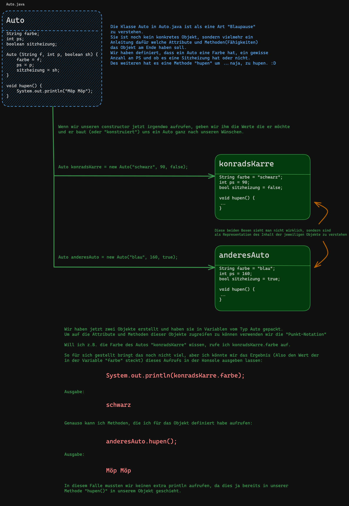

Mein stümperhafter Versuch das Grundkonzept der Objektorientierten Programmierung zu erklären.



Der kompilierbare Code zu dem Beispiel

Auto.java
```java
public class Auto {

    String farbe;
    int ps;
    boolean sitzheizung;

    Auto (String f, int p, boolean sh) {
        farbe = f;
        ps = p;
        sitzheizung = sh;
    }

    void hupen() {
        System.out.println("Möp Möp");
    }
}
```


SpassMitAutos.java
```java
public class SpassMitAutos {
    public static void main(String[] args) {

        Auto konradsKarre = new Auto("schwarz", 90, false);
        Auto anderesAuto = new Auto("blau", 160, true);

        System.out.println(konradsKarre.farbe);

        anderesAuto.hupen();
    }
}
```